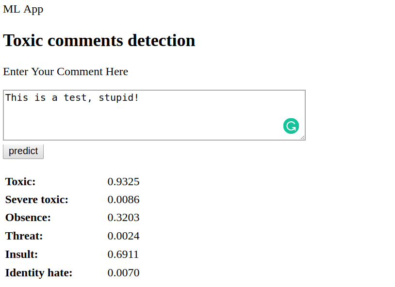

# Toxic-comments-detection

<p align="center">
  
</p>

This is a deployable machine learning model to rate toxic levels of comments from social networks. The data is taken from [Kaggle toxic comments classification challenge](https://www.kaggle.com/c/jigsaw-toxic-comment-classification-challenge). You can try the app [HERE](http://34.201.122.22/)

## Required packages
```bash
pip install -r requirements.txt
```

## The basic idea for this model:
* Clean text: lower all text, remove uncommon signs, expand abbreviations, correct mispelling words
* Tokenizing text data
* Create embedding vector using [Glove.6B](https://nlp.stanford.edu/projects/glove/)
* Train a deeplearning network with a bidirectional LSTM layer followed by two fully connected layers.

## The deployment step:

* Use `flask` to build a [local application](https://www.analyticsvidhya.com/blog/2017/09/machine-learning-models-as-apis-using-flask/)
* Create a docker image that contains the application and upload to docker hub
* Create an AWS EC2 instance, load and run the docker with the instance
* Set the instance securities to allow public connection

If you want to run the app locally, you can either pull the project from Docker, or from Github.

## Building application
```bash
python src/app_toxic_comments.py
```
The app is built using Flask api.

## Pull from docker
First install docker [here](https://docs.docker.com/install/)

```bash
docker run -p 80:80 dmdm02/toxic-comments-detection:latest
```
Then go to your browser at http://0.0.0.0:80. The app should be up and running

## Pull from github

```bash
git pull https://github.com/dmnguyen92/Toxic-comments-detection.git
```
### Installing required packages

```bash
pip install -r requirements.txt
```
### Training

```bash
pip install -r requirements.txt
```
### Building application

```bash
python src/app_toxic_comments.py
```
